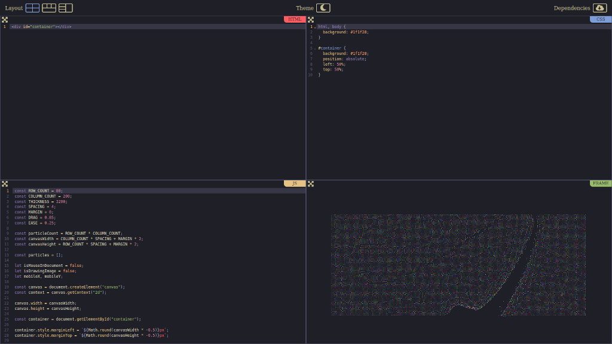
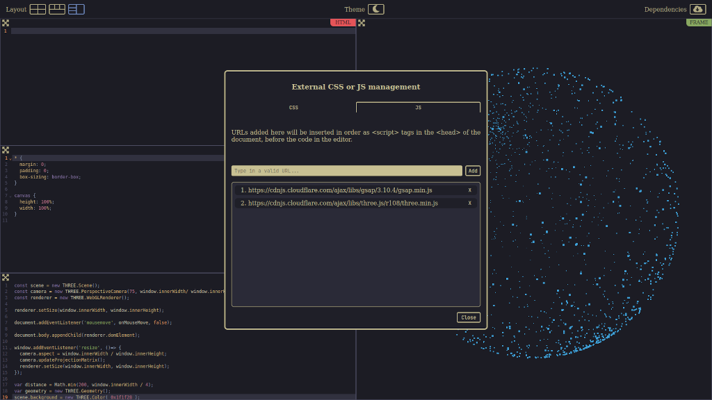

# Code Playground

A code playground for the web.
Provide HTML, CSS and JavaScript, and watch the result live in the browser.

## Installation

npm install

## Usage

npm run dev

## Production Build

npm run build

## Features

- Light and dark themes
- Three different layouts
- Full screen mode for code editors and iframe
- Support for external CSS stylesheets and JS libraries & scripts
- Full-featured code editor (CodeMirror)

## Built with

- [React](https://github.com/facebook/react/) - the framework
- [CodeMirror](https://github.com/codemirror/) - the code editor

## Author

- **Pierre-Alain Castella** - _Initial work_ - [metapho-re](https://github.com/metapho-re)

## License

This project is licensed under the MIT License - see the [LICENSE](LICENSE) file for details.
